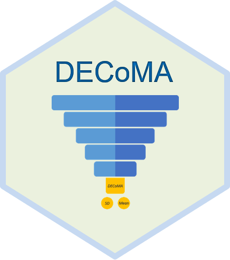

[Enoch Kang](https://orcid.org/0000-0002-4903-942X), 
[Kuan-Yu Chi](https://orcid.org/0000-0003-0763-8157), &
[Chiefeng Chen](https://orcid.org/0000-0002-1595-6553)

*DECoMA* is the abbreviation for Data Estimation and Conversion for
Meta-Analysis, which is an Excel-based tool for estimating sample mean
and standard deviation (SD). 
This tool is a freely available Microsoft 
Office Excel file with Excel-macros, and it is developed by methodology 
team members in the Cochrane Taiwan and Wan Fang Hospital. 
The circumstances and formulas included in the *DECoMA* have passed 
external validation and the information is published on an academic 
journal. Users can find and cite the following reference:

Chi, KY., Li, MY., Chen, C. et al. Ten circumstances and solutions for 
finding the sample mean and standard deviation for meta-analysis. 
*Syst Rev* **12**, 62 (2023). [https://doi.org/10.1186/s13643-023-02217-1](https://doi.org/10.1186/s13643-023-02217-1)
([click here to download ris file](https://citation-needed.springer.com/v2/references/10.1186/s13643-023-02217-1?format=refman&flavour=citation))

-   [Feature](#features)
-   [Steps](#steps)
-   [To do list](#to-do-list)

## Features

*DECoMA* provids users 10 common scenarios with solutions for finding
mean or SD for meta-analysis. First five circumstances can be used when you
have descriptive statistics of a research group. Rest five circumstances 
can be used when you have effect estimates with other statistics for two 
group comparison.

Briefly, *DECoMA* can be used for finding sample mean from descriptive
statistics in terms of minimum, first quantile, median, third quantile,
as well as maximum. Besides, *DECoMA* can be used for finding SD from
abovementioned descriptive statistics, or standard error, confidence
interval, t-value, z-score, or p-value with sample size.

## Steps

Users can easily find sample mean and SD in three steps:

**Step 1.** Choose circumstance according to the scenario you are
encountering.

**Step 2.** Green area is for data input, and you can type in the
values you extracted from the original report according to the guidance
labels.    Input values should be entered from the smallest to the largest
if a formula requests more than two values of dispersion statistics.

**Step 3.** Blue area is for data output, and you can directly
copy them for meta-analysis.

## To do list

-   Spread *DECoMA* to researchers who may be in need.
-   Collect feedback from users to extent scenarios in the future.
